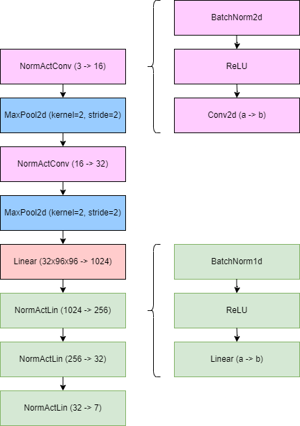
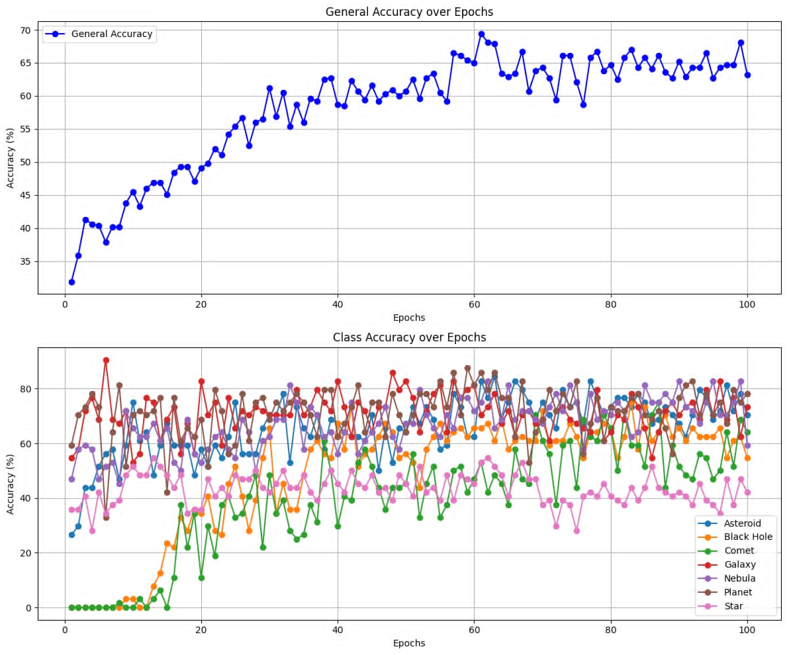

# Astronomical-image-classifier

dataset: https://www.kaggle.com/datasets/razaimam45/spacenet-an-optimally-distributed-astronomy-data/data

Datasets of constellations and stars were merged, and the asteroid set was oversampled.

# Model



# Model Training



## Best results

```
Accuracy for class Asteroid is: 82.8 %
Accuracy for class Black Hole is: 65.6 %
Accuracy for class Comet is: 53.1 %
Accuracy for class Galaxy is: 70.3 %
Accuracy for class Nebula is: 75.0 %
Accuracy for class Planet is: 85.9 %
Accuracy for class Star  is: 53.1 %
General accuracy is: 69.4 %
ep: 61/150, train_loss: 1.5740, val_loss: 1.4815
```